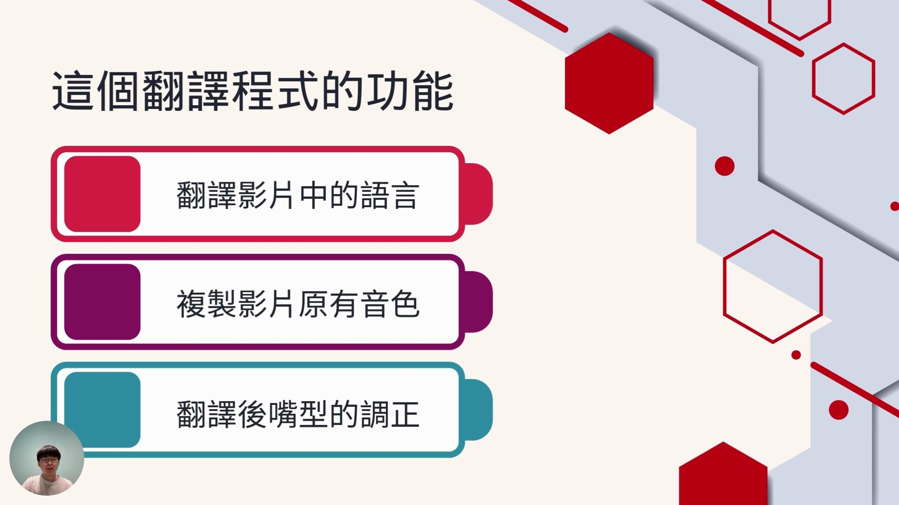
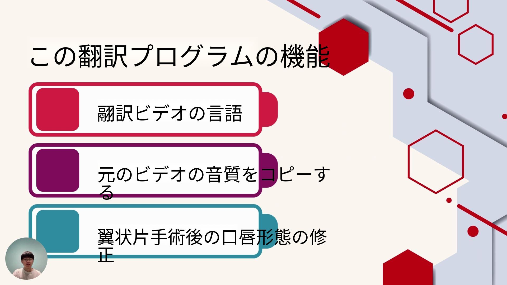

# 影片投影片翻譯工具

這是一個能夠從影片中擷取投影片，進行 OCR 文字辨識和翻譯，並將翻譯好的投影片重新合成為影片的工具。




## 📝 功能特色

- 🎞️ **投影片擷取**：從影片中自動擷取投影片畫面
- 🔍 **OCR 文字辨識**：自動辨識投影片中的繁體中文文字
- 🌐 **自動翻譯**：使用 Google Gemini API 將文字翻譯成日文（可自訂其他語言）
- 🖌️ **文字替換**：移除原始文字並置換為翻譯後的文字
- 🎬 **影片合成**：將翻譯後的投影片重新合成為完整影片

## ⚙️ 安裝指南

### 系統需求

- Python 3.8 或更高版本
- 作業系統：Windows, macOS, Linux

### 安裝必要套件

```bash
# 安裝必要套件
pip install -r requirements.txt
```

requirements.txt 檔案內容：
```
opencv-python==4.8.1
easyocr==1.7.1
numpy==1.26.0
Pillow==10.0.0
imagehash==4.3.1
requests==2.31.0
```

### 必要的字型檔

請確保在程式目錄中有 `NotoSansCJKjp-Regular.otf` 字型檔案，用於繪製日文文字。
您可以從 [Google Fonts](https://fonts.google.com/noto/specimen/Noto+Sans+JP) 下載此字型。

## 🚀 使用方法

### 1. 獲取 Gemini API 金鑰

1. 前往 [Google AI Studio](https://aistudio.google.com/)
2. 註冊並創建一個 API 金鑰
3. 複製 API 金鑰，之後會在程式中使用

### 2. 運行程式

```bash
python main.py
```

### 3. 使用步驟

#### 步驟一：投影片擷取與翻譯

1. 在第一個標籤頁中輸入您的 Gemini API 金鑰，然後點擊「鎖定金鑰」
2. 選擇要處理的影片檔案
3. 設定適當的幀間隔和雜湊差異門檻
   - 幀間隔：每隔多少幀檢查一次，建議值為 15-30
   - 雜湊差異門檻：判斷投影片變化的閾值，建議值為 5-10
4. 點擊「開始擷取」按鈕
5. 等待系統完成投影片擷取與翻譯

#### 步驟二：影片合成

1. 切換到第二個標籤頁「翻譯影片合成」
2. 選擇原始影片（與步驟一相同的影片）
3. 確認翻譯後投影片目錄（預設為 `ocr_output`）
4. 指定輸出影片的存檔路徑
5. 設定與步驟一相同的幀間隔和雜湊差異門檻
6. 點擊「開始合成影片」按鈕
7. 等待系統完成影片合成

## 📁 檔案結構

```
.
├── main.py              # 主程式
├── requirements.txt     # 必要套件清單
├── NotoSansCJKjp-Regular.otf  # 日文字型檔
├── slides_output/       # 擷取的原始投影片存放目錄
└── ocr_output/          # 翻譯後的投影片存放目錄
```

## 🔧 參數調整說明

### 投影片擷取參數

- **幀間隔 (frame_interval)**：每隔多少幀檢查一次投影片變化。較大的值會加快處理速度，但可能會錯過短暫顯示的投影片。
- **雜湊差異門檻 (hash_diff_threshold)**：判斷兩幀之間差異的閾值。較大的值意味著較大的差異才會被視為新投影片，較小的值會更敏感地偵測變化，但可能會產生重複的投影片。

### OCR 與翻譯參數

- **OCR 信心度門檻**：在程式碼中設定為 0.4，可以調整來過濾低信心度的 OCR 結果。
- **目標語言**：預設為日文 (Japanese)，可以在 `translate_with_gemini` 函數中修改 `target_lang` 參數。

### 影片合成參數

- 影片合成功能使用與投影片擷取相同的幀間隔和雜湊差異門檻參數，以確保投影片變化點的準確匹配。

## 🔄 工作流程說明

1. **投影片擷取**：
   - 程式透過計算影片幀之間的感知雜湊 (perceptual hash) 來偵測投影片變化
   - 當偵測到新投影片時，程式會儲存該幀為圖片檔

2. **OCR 與翻譯**：
   - 使用 EasyOCR 辨識投影片中的繁體中文文字
   - 將辨識到的文字送到 Gemini API 進行翻譯
   - 使用影像處理技術去除原始文字
   - 將翻譯後的文字繪製到投影片上

3. **影片合成**：
   - 使用與投影片擷取相同的邏輯找出投影片變化點
   - 在變化點處插入對應的翻譯後投影片
   - 保持原始影片的幀率和解析度，輸出合成後的影片

## 📊 效能考量

- OCR 和翻譯過程需要網路連接和 API 呼叫，會是處理時間的主要因素
- 對於長影片，建議增加幀間隔以加快處理速度
- 程式使用多執行緒處理，以避免 UI 凍結

## 📜 授權條款

本專案採用 MIT 授權條款 - 詳情請參閱 [LICENSE](LICENSE) 檔案。

## 👥 貢獻指南

歡迎貢獻！如果您想為這個專案做出貢獻，請遵循以下步驟：

1. Fork 這個專案
2. 創建您的功能分支 (`git checkout -b feature/amazing-feature`)
3. 提交您的變更 (`git commit -m 'Add some amazing feature'`)
4. 推送到您的分支 (`git push origin feature/amazing-feature`)
5. 開啟一個 Pull Request

## 📞 聯絡方式

如果您有任何問題或建議，請在 GitHub Issues 區提出。

---

⭐ 如果這個專案對您有幫助，請給它一個星星！
